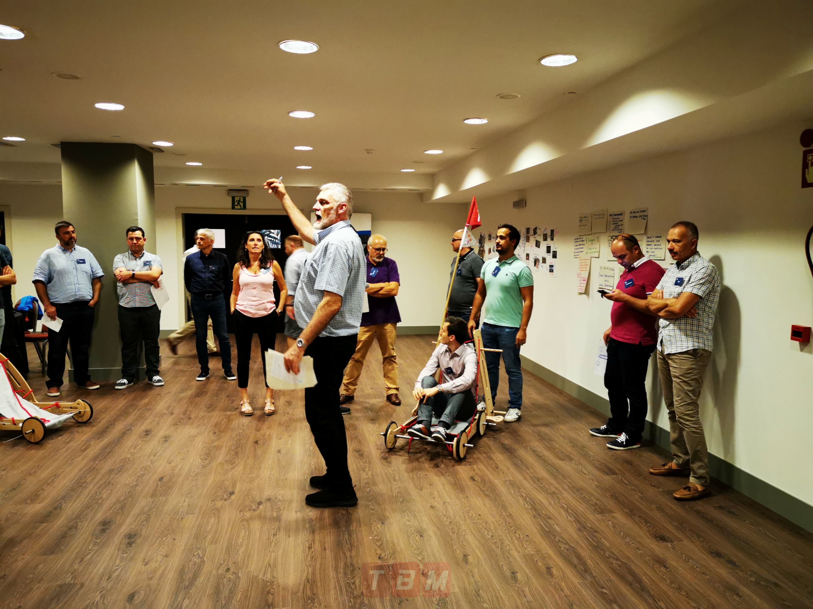
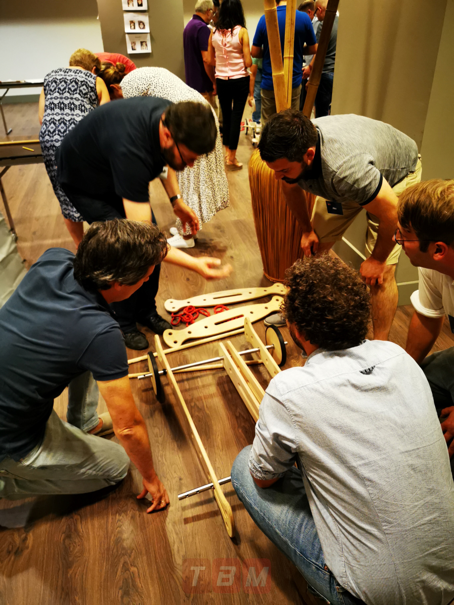
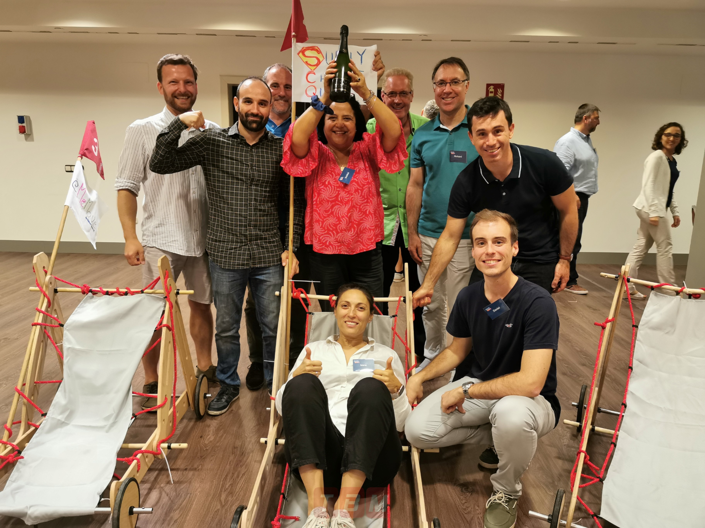
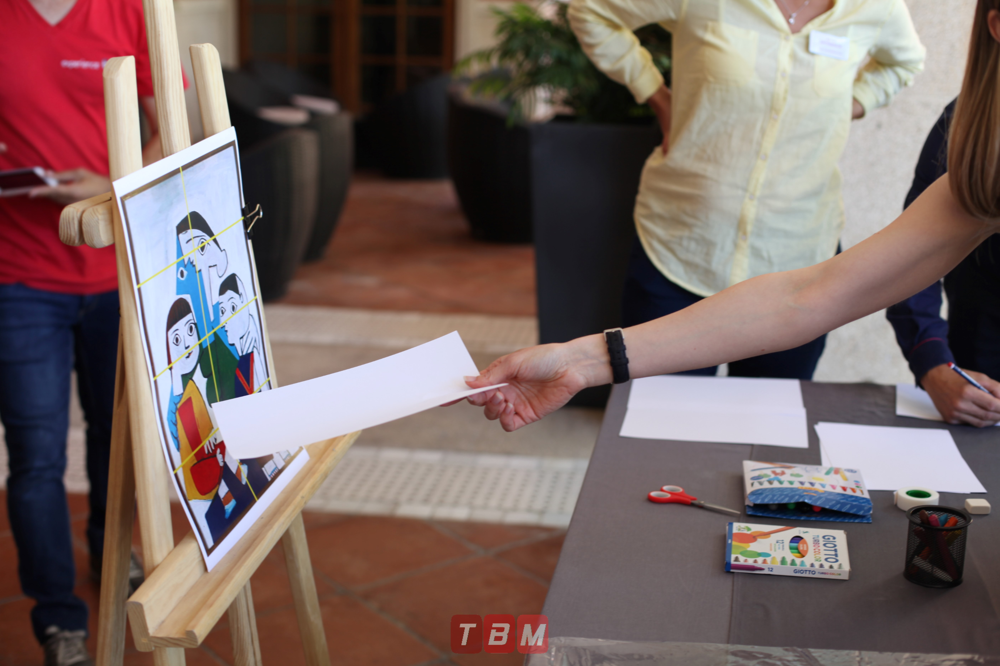
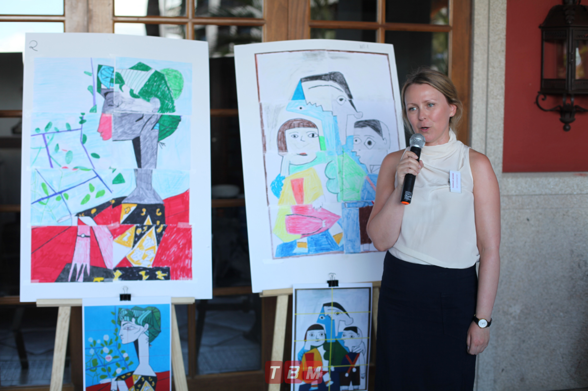
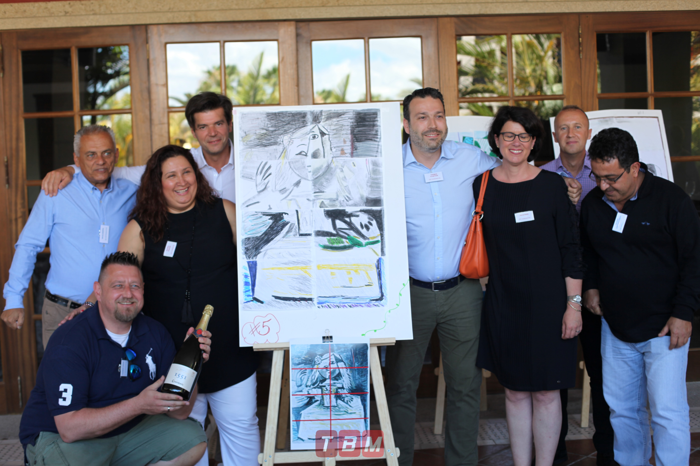

<style>
.list-group-item.active, .list-group-item.active:focus, .list-group-item.active:hover {
    background-color: #EA5933;
}
</style>

<style>
.nav>li>a {
    position: relative;
    display: block;
    padding: 10px 15px;
    color: #EA5933;
    font-weight: bold;
}
.nav-pills>li.active>a, .nav-pills>li.active>a:hover, .nav-pills>li.active>a:focus {
    color: white;
    background-color: #EA5933;
}
</style>

<style>

.precio{
background-color:#828282;
color: white;
padding: 10px;
border: 1px solid black;
margin-left: 5px;
border-radius: 5px;
}
</style>

<br>


<script> 
    $(document).ready(function() { 
    $head = $('#header'); 
    $head.prepend('<A href = https://www.cuttingedge-events.com></A>') 
    }); 
</script> 


```{r echo=FALSE, message=FALSE,warning=FALSE}
library(readxl)
library(dplyr)
library(knitr)
```

# PROGRAME

<iframe src="timeline.html" frameborder="0" width="100%" height="1000" scrolling="no"></iframe>

## Map

<iframe src="https://www.google.com/maps/d/embed?mid=1hF9MGJ7JXxc8xKSBUG5uXyIGAGS57rX-&hl=es" width="100%" height="480"></iframe>

</br>

## Hilton el Higueron

<iframe src="Hilton El Higueron/ElHigueron.html" frameborder="0" width="100%" height="1500" scrolling="no"></iframe>

**Plenary room**

The name of the rooms is Tapies and it has capacity for 50 pax in cabaret style

</iframe>


</br>

<iframe width="100%" height="500" src="https://www.youtube.com/embed/UWHgBiSqHwM" frameborder="0" allow="accelerometer; autoplay; encrypted-media; gyroscope; picture-in-picture" allowfullscreen></iframe>

</br>


## Restaurant Trocadero Arena

<iframe src="TrocaderoArena/TrocaderoArena.html" frameborder="0" width="100%" height="1250" scrolling="no"></iframe>

</br>


<div class="precio">
<p> Rates: 
  <ul>
  * Dinner menu including starters to share, main course, dessert, drinks (1 bottle of wine each 3 pax and water) and Coffee, from: 75€ VAT inc

   </ul>
</p>
</div>

</br>

## Teambuilding options {.tabset .tabset-fade .tabset-pills}

### Sand Activities 

Hotel El Higueron has its own "beach" to organize these kind of tournaments.

All the sports activities are coordinated and directed by our professional monitors.

minimun 20 pax 


</iframe>
</iframe>


### Strategy Games

**How it works**

Since these games have strategy as their main component, communication and leadership will be the essential factors. So each group will have to work properly for the end of the day trying to rise to victory.

Each game will have a scoring system according to the difficulty of it. We have many games to choose from, some like this one:

  * Giant Jenga
* Control Tower
* Spider Web
* The Maze
* Blind Box
* Tangram
* And many more
  
  
These strategy games only can be organized at Hotel Higueron, in one of its meeting rooms.

</iframe>
</iframe>
</iframe>

### F1 Designer

**How it works**

This activity explore the following aspects of team building :

  * Leadership
* Communication
* Change management
* Creativity
* Time management
  
All team members will have to cooperate closely and in an organized way in order to design and create their own F1 car, like if they were an official formula one team. Teams will have to choose wisely who is the correct person to perform each task (mechanic, design, engineering, Management, time keeper, etc)


Once the car is finished and properly built, you will have to test it on an circuit and proove that the design and construction is the best.

We will provide all the materials for this activity, as well as to create an agility racing circuit for the occasion. Your car will have to proove that it is fast, safe, and the most important thing, that it will end in one single piece.

Our Formula One challenge is a perfect occasion to organize a team building activity for those groups that are looking for a fun, it can be organized in the hotel facilities.


</iframe>
</iframe>
</iframe>


### Picasso Challenge

**How it works**

***First Chapter:**

Once the teams has been created, some mind games will have to be solved in a determinated period of time. Completing these games will provide the teams with materials that are neccessary to paint the Picasso painting at the end, materials such as felt pen colors, cardboard, etc

Once all the teams has finished these games, each team will have to choose what Picasso Paint want to draw, have in mind that sometimes the most simple painting could end up being the most difficult one.

***Second Chapter:**

The Picasso paintings selected for this experience are divided in small pieces, this means that each member of the tam will have to paint just one part of the paint, so it is very important to have a good comunication here, as the teams has to coordinate to create the whole painting. You cannot assamble the piece until the end, so make sure that everyone has done their job correctly.

At the end of this experience, we will expose all the paintings from the teams and our professional staff will choose who is the winner.

</iframe>
</iframe>
</iframe>


# BUDGET

<iframe src="budgetelhigueron.html" frameborder="0" width="100%" height="1000" scrolling="no"></iframe>

</br>

*****


# TERMS AND CONDITIONS

  * Rates valid for Oticon Seminar - March 2020
  
  * For a group of minimum 35 pax.
  
  * Cutting Edge Events management fee including in the detailed rates
  
  * VAT included. 
  
  * No reservation has been done. Availability upon request.
  
*****


